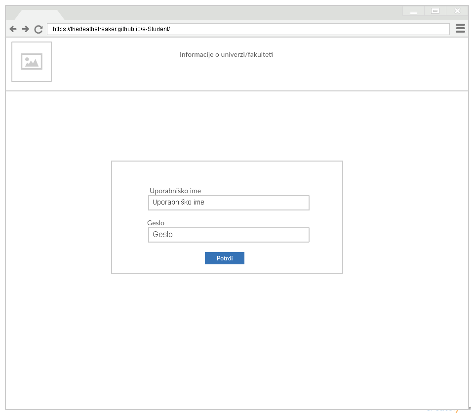
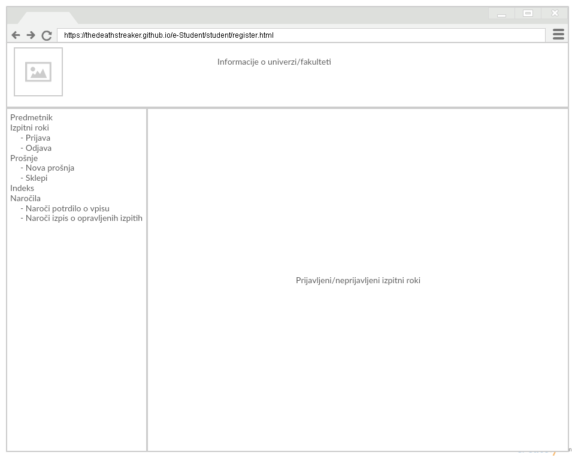

# Project for class Web Programming #

## Chosen theme [e-Študent](https://ucilnica.fri.uni-lj.si/mod/page/view.php?id=1436#eStudent) ##

## What is e-Študent ##
It's web application that replaces physical indeks (book with grades of faculty) and therefore make life of students/professors/employees of the faculty easier.
It's also more ecological since it removes the need of using a lot of paper to create indeks.

## Who can use this application ##
Students and employees of faculty

## What devices will be supported ##
Mobile devices(Android smartphones/tablets, iOS smartphones/tablets) and desktop browsers (Chrome, Safari, Firefox)

## Sitemaps ##
1. Student:
  
2. Professor:
3. Referat:

## Wireframes ##
1. Landing page:
  
2. First page:  
  2.1. Student:
    
  2.2. Professor:
    
  2.3. Referat:
    
3. Additional pages:  
  3.1. Student registration/unregistration for exam:
    
  3.2. Student requests:
    
  3.3. Student specific request:
    
